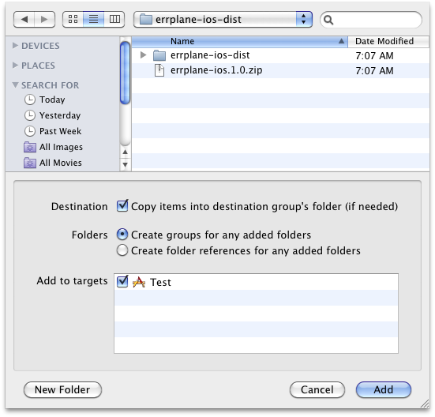

Errplane
========
This library integrates your applications with [Errplane](http://errplane.com), a cloud-based tool for handling exceptions, log aggregation, uptime monitoring, and alerting.

Installing the library
----------------------
The easiest way to get started is to download the prebuilt universal static library with headers from github at [errplane-ios.zip](https://github.com/errplane/errplane-ios/blob/master/errplane-ios-dist/errplane-ios.1.0.zip).
This library was built with support for arm6 and arm7 architectures and supports iOS 4.2 and above.  After downloading follow these steps to import it into your project.

1.  Unzip the downloaded zip file - this will create a directory called `errplane-ios-dist`.  The directory will contain three files:

    `EPDefaultExceptionHash.h` - used to override the default exception hash behavior (more on that later)
    
    `Errplane.h` - the entrypoint into the errplane-ios library
    
    `liberrplane-ios.<version>.a` - the universal static library for simulators and devices

2.  Open your project in Xcode and click on File-->Add Files to "YourProjectName"...
3.  You should see a screen that looks like this:

    

4.  Select the `errplane-ios-dist` directory that was created when you unzipped, checkmark the 'Destination' check box and select the 'Create groups for any added folders' radio button.
    Also make sure to select the target[s] that will use the library.
5.  After clicking 'Add', the headers will be viewable by your source and the library will already be set to link with your target.  You're now ready to start using it. 

Initializing the library
------------------------
The library is initialized with the following arguments:

    url: the base Errplane url (e.g. - http://errplane.com/)
    api: your api_key used to verify Errplane usage
    app: your app name configured in Errplane
    env: the environment you are using (usually one of: production, staging, development)

Using these values the library is initialized using:

    BOOL success = [Errplane setupWithUrl:url apiKey:apiKey appKey:appKey environment:envKey];

success is true if none of the values passed in were nil and if the url was valid.

Additionally, to set a session user to better trace exceptions reported to Errplane the following can be used:

    [Errplane setSessionUser:@"string that identifies the current user"];

Reporting
---------
Errplane allows you to report any amount of useful numeric and context relevant data that can be used for analyzing performance and usage of your application.
There are six methods used for reporting - use the methods that make the most sense for your application.  For each reporting method, the name passed in to the `[Errplane time]` selectors must be < 250 characters.
The following are simple examples for each method:

    // simple reporting (default int value of 1 is sent to Errplane)
    [Errplane report:@"user logged in"];
    
    // reporting providing your own useful int value
    [Errplane report:@"hours_since_last_login" withInt:10];
    
    // reporting providing your own useful double value
    [Errplane report:@"avg_usage_pcnt" withDouble: 99.9];
    
    // reporting providing your own useful context (uses default int value of 1)
    [Errplane report:@"problem_with_server" withContext:@"Delayed Server Request"];
    
    // reporting providing your own useful context and int value
    [Errplane report:@"slow_processing" withInt: 2500
                           andContext:@"Slow Processing"];
    
    // reporting providing your own useful context and double value
    [Errplane report:@"average_response_time"
                           withDouble: 192.75
                           andContext:@"Average Response Time"];

Exception Reporting
-------------------
There are four basic methods for reporting exceptions.  Again, use the ones that make the most sense for your application.  The examples assume `exception` is a populated `NSException`.

    // basic default
    [Errplane reportException:exception];
    
    // with custom data
    [Errplane reportException:exception withCustomData:@"custom data for you to pass in can be json"];
    
    // hash override
    [Errplane reportException:exception withHash:@"hash this"];
    
    // hash override with custom data
    [Errplane reportException:exception withHash:@"hash this" andCustomData:
                      @"more custom data"];

Breadcrumbs
-----------
Breadcrumbs are useful for providing checkpoints for your app leading up to the point where an exception is thrown.  The Errplane library
stores the last 10 breadcrumbs you provide and sends them along when you report an exception:

    [Errplane breadcrumb:@"Did this path of execution lead to the exception?"];
    [Errplane breadcrumb:@"maybe this one instead?"];
    
    // code that cuases exception, and now in the @catch block
    @catch (NSException* exception) {
        [Errplane reportException:exception];
    }

Timed Block Reporting
---------------------
Timed block reporting allows you to report the time taken to complete a block of code.  As when reporting events to Errplane, the name passed in to the `[Errplane time]` selectors must be < 250 characters.
There are two methods for timing your code.  The first method takes a block that requires no parameters:

    void (^timeBlock) (void);
    
    timeBlock = ^(void) {
        // sleep
        [NSThread sleepForTimeInterval:3];
    };
    
    [Errplane time:@"veryUsefulTimedSleepBlock" withBlock:timeBlock];
    
The second method is for a block that requires an input parameter:

    void (^timeBlock) (id);
    
    // define the block
    timeBlock = ^(NSArray* blockParam) {
        for (int i = 0; i < [blockParam count]; i++) {
            NSArray* currArr = [((NSString*)[blockParam objectAtIndex:i]) componentsSeparatedByString:@" "];
            
            [NSThread sleepForTimeInterval:[((NSString*)[currArr objectAtIndex:1]) intValue]];
        }
    };
    
    NSArray* blockParam = [NSArray arrayWithObjects:@"string 2",@"string 1",@"string 2", nil];
    
    [Errplane time:@"uNeverKnowWhenSleepIsGoingToHoseYouOutOfAMilliOr2" withBlock: timeBlock
                       andParam: blockParam];
    

Customizing How Exceptions Get Grouped
--------------------------------------
Although the `[Errplane reportException:(NSException*) withHash:(NSString*)]` methods allow you to override the exception hash, you may have
multiple exception types that you want grouped the same way.  To avoid the hassle of remembering to provide the same overridden hash every time
you report an exception, you can override the default exception hashing method and tell the Errplane library about it:

    // MyHashFunc.h
    #import "EPDefaultExceptionHash.h"

    @interface MyHashFunc : EPDefaultExceptionHash
    
    @end

    //---------------------------------------------------------------------------------------------------------
    
    // MyHashFunc.m
    
    #import "MyHashFunc.h"

    @implementation MyHashFunc

    -(NSString*) hash:(NSException*) ex {
    
        // hash specific exception messages to their own category
        if ([[ex reason] rangeOfString:@"use my overriden hash function"
                           options:NSCaseInsensitiveSearch].location != NSNotFound) {
            return @"overriddenHash";
        }
    
        // use the default
        return [super hash:ex];
    }

    @end
    
    //---------------------------------------------------------------------------------------------------------
    
    // assumes you've already initialized the Errplane library at this point, now set the override
    MyHashFunc* exHash = [[MyHashFunc alloc] init];
    [Errplane exceptionHashOverride:exHash];
    
    // drop a breadcrumb for the heck of it
    [Errplane breadcrumb:@"default exception hash method overridden"];
    
    // your app code that leads to an exception
    @try {
        [NSException raise:@"usingCustomHashOverride"
                    format:@"This will use my overriden hash function for sure."];
    }
    @catch (NSException* exception) {
        // uses the overridden hash category
        [Errplane reportException:exception];
    }

Full Examples
-------------
Though all of the above examples are adapted from the tests, the full code for the tests can be found at:
[Errplane Tests](https://github.com/errplane/errplane-ios/blob/master/errplane-iosTests/ErrplaneTest.m)
